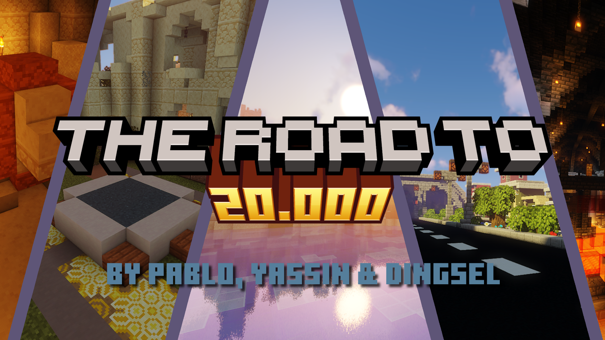
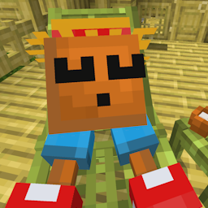

# 🌟 THE ROAD TO 20K - A Bedrock Add-Ons JAM Project

**Road to 20K** is a Minecraft addon for a World in which you Play Minigames to
get to 20K points. It was created for the Bedrock Addons 20K Members JAM.

## 📖 Info

1. [TEAM](credits)
2. [LICENSE](LICENCE)
3. [BUILD STATUS](https://github.com/Dingsel/20kJam/actions)

## 🛠 Development

Created with [cmca](https://www.npmjs.com/package/create-mca). It takes care of
bundling with esbuild, exporting to Minecraft, and TypeScript, based on
[regolith](https://bedrock-oss.github.io/regolith/).

### Building Locally

0. Make sure to be using Windows
1. Clone the repository
2. Run `npm i`
3. Run `npm run dev` to export the pack directly into Minecraft or
   `npm run export` to export the pack into the `build` folder.
